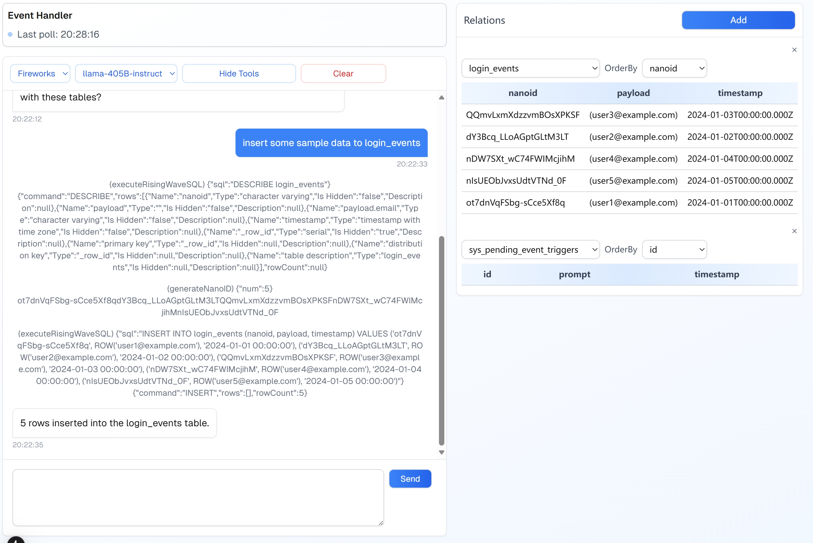

# Event-Driven Agent Demo

This is the repo for the demo in *Towards Cognitive Agent: Beyond Q&A: Build Event-Driven Agents with Streaming Database*



## Quick Start

1. Set the API KEY of your AI model.

    Supported providers:
    - [x] Groq
        ```shell
        export GROQ_API_KEY=your-api-key
        ```
    - [x] Cohere
        ```shell
        export COHERE_API_KEY=your-api-key
        ```
    - [x] xAI
        ```shell
        export XAI_API_KEY=your-api-key
        ```
    - [x] Mistral
        ```shell
        export MISTRAL_API_KEY=your-api-key
        ```
    - [x] Fireworks
        ```shell
        export FIREWORKS_API_KEY=your-api-key
        ```
    - [x] OpenAI
        ```shell
        export OPENAI_API_KEY=your-api-key
        ```

    *This Demo supports `HTTPS_PROXY`, if you have trouble accessing the LLM provider, please set the `HTTPS_PROXY` environment variable. For more details, check [lib/proxiedFetch.js](./lib/proxidFetch.js).*


2. Start risingwave in one TTY 1.

    ```shell
    # Install RisingWave in your local machine
    curl https://risingwave.com/sh | bash
    # Start RisingWave
    ./risingwave
    ```

    *If you already have a RisingWave instance, set the credentials at [lib/rw.ts](lib/rw.ts)*

3. Run the project in another TTY 2.

    ```shell
    pnpm i
    pnpm run dev
    ```

4. Open the browser and go to `http://localhost:3001`.

5. Chat with the Agent:

    ```
    🤔: Create table `login_events`, columns are nanoid, email, timestamp.
    🤔: Tell me when @example.com folks login.
    🤔: Insert some sample data to login_events that will trigger the event listener.
    ```
